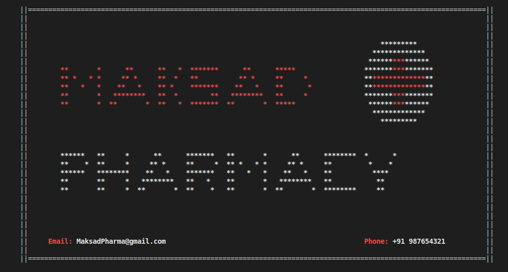
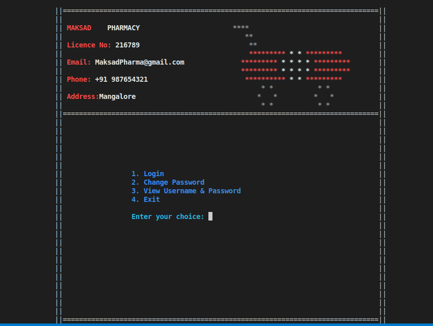
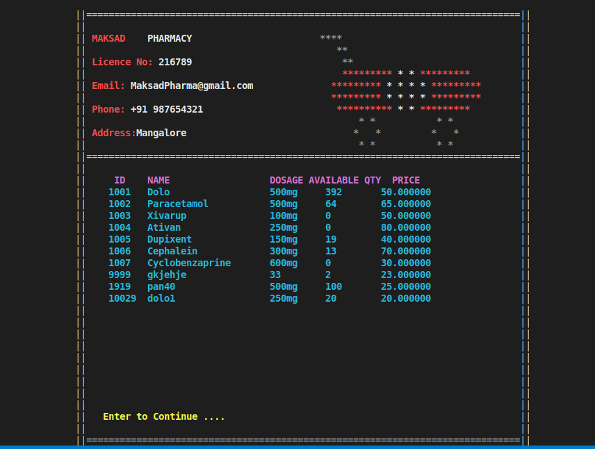
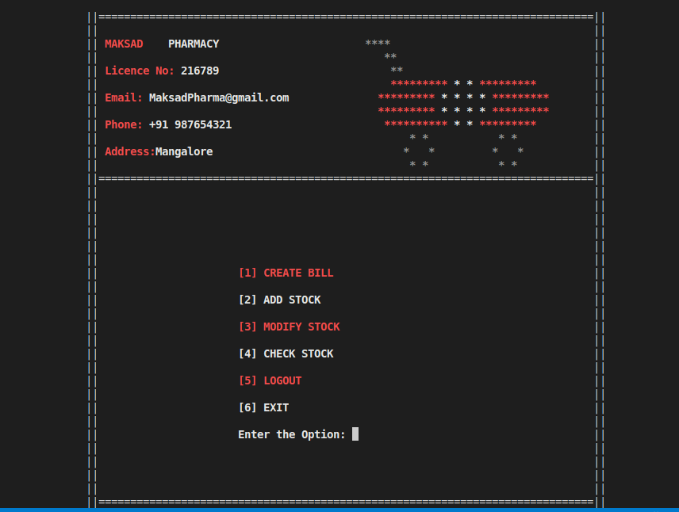
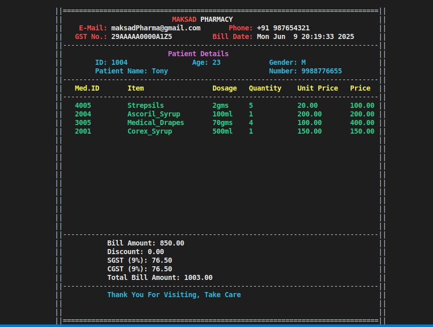

# 💊 Pharmacy Management System (CLI-based in C)

A comprehensive command-line interface (CLI) based **Pharmacy Management System** designed for pharmacy owners. This C project facilitates inventory management, patient tracking, and automated billing — all through a beautiful colored terminal interface with custom templates.

---

## 🚀 Features

### 🧑‍💻 Authentication
- Secure login for the pharmacy owner.
- Prevents unauthorized access to sensitive pharmacy operations.

### 🧾 Billing System
- Generate itemized customer bills.
- Beautifully formatted output using CLI colors and positioning.
- Automatically updates stock after bill generation.
- Stores purchased item records in `purchasedItems.txt`.

### 📦 Stock Management
- **View current stock** across various medicine categories.
- **Add new items** into the stock, categorized properly.
- **Update existing stock** with modified quantity or price.
- **Search and manage stock** by name or ID.
- Stock stored persistently in files like `tablets.txt`.

### 🧍 Patient Information Management
- Store patient details with a unique ID.
- Information persisted in `patient.txt`.
- Useful for maintaining medical history or prescription records.

### 🎨 Custom CLI UI
- Colored text and ASCII art-based interface.
- Custom-made templates for menus, borders, and screens.
- Uses `gotoXY` for precise cursor control.

### ScreenShots 
<p align="center">
<table>
  <tr>
    <td align="center">
      <br>
      <b>LandingPage</b>
    </td>
    <td align="center">
      <br>
      <b>Login Page</b>
    </td>
  </tr>
  <tr>
    <td align="center">
      <br>
      <b>Stock Details</b>
    </td>
    <td align="center">
      <br>
      <b>Options Page</b>
    </td>
  </tr>
</table>
</p>
<p align="center">
   
</p>
<p align="center">
   <b> Generated Bill </b>
</p>


## 🛠️ How to Run

**Compile the project** (Linux terminal):
```bash
   gcc main.c -o pharmacy.out
   ./pharmacy.out
```
Ensure all .c files are in the same directory or include paths are properly handled.

## 📌 Requirements

###  Linux (Recommended)
- GCC Compiler 
- Linux Terminal (supports ANSI colors and cursor movement)
- Basic knowledge of C and file handling

###  Windows
- GCC via MinGW or TDM-GCC, or use WSL (Windows Subsystem for Linux)
- Recommended to run in Windows Terminal or PowerShell
- Replace `system("clear")` with `system("cls")` in code 
- Legacy cmd.exe may not display colors or cursor positioning correctly


## 👥 Contributors

This project was developed by the following team members:

- ***Glen Fonceca***
- ***Dheeraj D Nayak***
- ***Alson Mathias***
- ***Anush Shetty***
- ***Afhaam Asief Ali Muhammed***


